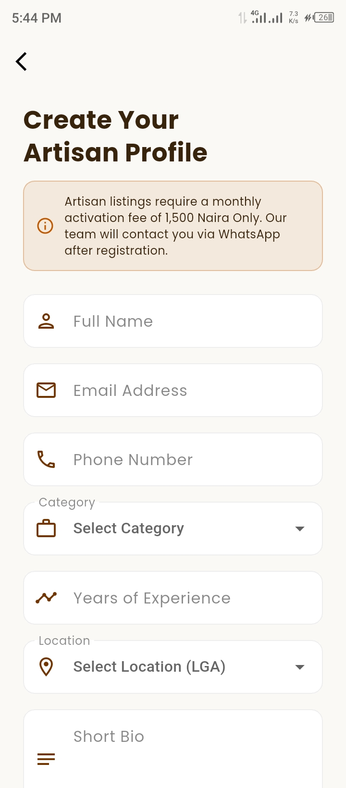
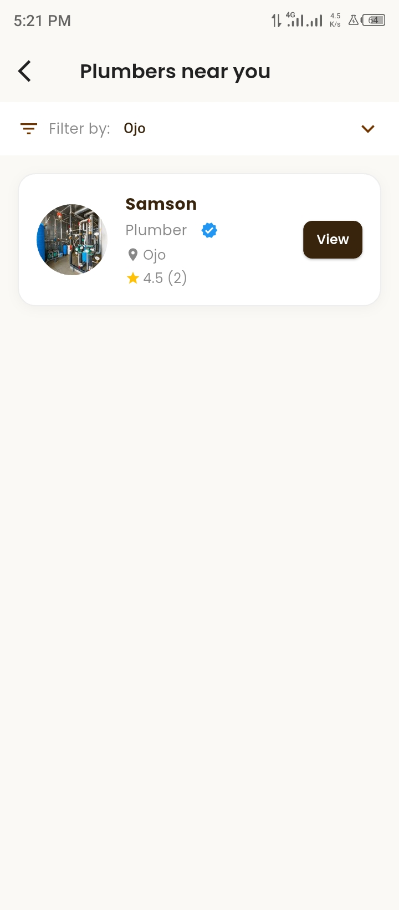

# Skilld 🔧
A two-sided marketplace app built with Flutter and Firebase that connects customers with skilled artisans (plumbers, electricians, painters, carpenters, and AC technicians) in Lagos, Nigeria.

---

## 🚀 Live on Google Play
https://play.google.com/store/apps/details?id=com.ajose.skilld

---

## Screenshots

  
  
  
  
  
  
  
  
  
  
  
  
  
  
  
  
  
  

---

## Features

### Customer Side
- **Authentication** — Register, login, email verification and forgot password via Firebase Auth
- **Home Screen** — Browse artisan categories and recently joined artisans with pull to refresh
- **Search** — Search artisans by name or category in real time
- **Artisan List** — Browse artisans by category with location filter and star ratings
- **Artisan Profile** — View full artisan profile with bio, experience, location and work photos
- **Direct Contact** — Call or WhatsApp any artisan directly with one tap
- **Save Artisans** — Save favourite artisans for quick access later
- **Ratings & Reviews** — Leave a star rating and written review for artisans
- **Work Photos** — View artisan's portfolio of work images
- **Edit Profile** — Update name, phone number and profile photo
- **Change Password** — Securely update account password
- **Delete Account** — Permanently delete account and all associated data

### Artisan Side
- **Registration** — Register with full profile including category, experience, location and bio
- **Pending Activation** — Profile reviewed and activated by admin within 24 hours
- **Dashboard** — View real time profile view count, average rating and recent customer reviews
- **Work Photos** — Upload up to 6 portfolio photos to showcase work to customers
- **Edit Profile** — Update bio, location, phone and profile photo
- **Delete Account** — Permanently delete account and all associated data

### General
- **Profile & Work Photos** — Upload and update photos via Cloudinary
- **Persistent Login** — Stay logged in across app restarts
- **Custom Theme** — Unique Chocolate Truffle color palette
- **Smooth Onboarding** — 3 slide onboarding experience shown only on first launch
- **Pull to Refresh** — Refresh data on home, search, saved, profile and artisan screens
- **Firestore Security Rules** — Role based access control protecting user data

---

## Built With
- [Flutter](https://flutter.dev/) — UI framework
- [Firebase Authentication](https://firebase.google.com/products/auth) — User login and registration
- [Cloud Firestore](https://firebase.google.com/products/firestore) — Cloud database
- [Flutter Riverpod](https://riverpod.dev/) — State management
- [Cloudinary](https://cloudinary.com/) — Profile and work photo hosting
- [url_launcher](https://pub.dev/packages/url_launcher) — Call and WhatsApp integration
- [image_picker](https://pub.dev/packages/image_picker) — Photo selection from gallery
- [shared_preferences](https://pub.dev/packages/shared_preferences) — Persistent login and onboarding state
- [font_awesome_flutter](https://pub.dev/packages/font_awesome_flutter) — WhatsApp icon
- [google_fonts](https://pub.dev/packages/google_fonts) — Poppins typography
- [http](https://pub.dev/packages/http) — Cloudinary image upload requests
- [flutter_native_splash](https://pub.dev/packages/flutter_native_splash) — Native splash screen for Android 12+
- [flutter_launcher_icons](https://pub.dev/packages/flutter_launcher_icons) — Custom app icon generation

---

## Architecture
- **Pattern:** Feature-based folder structure
- **State Management:** Riverpod (Providers, StreamProviders, StateNotifier)
- **Backend:** Firebase (Auth + Firestore)
- **Image Hosting:** Cloudinary

---

## Author
**Ajose Emmanuel**
